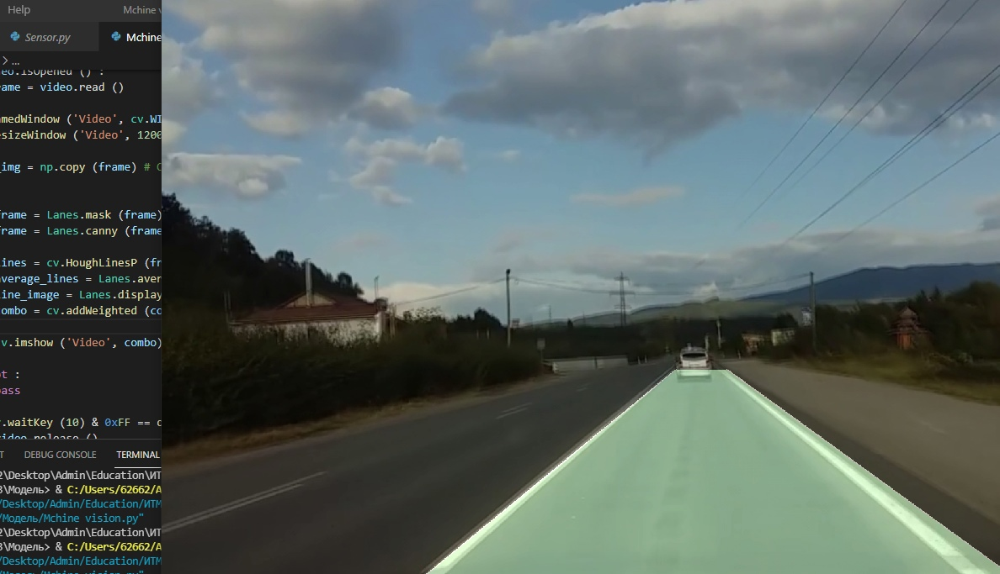

# Алгоритма детектирования линии дорожной разметки посредством оператора Кенни

В данной работе представлена реализация алгоритма детектирования дорожной ращзметки и дорожного коридора на беспилотном автотранспорте посредством классчиеского компьютерного зрения (алгоритм Кенни)

